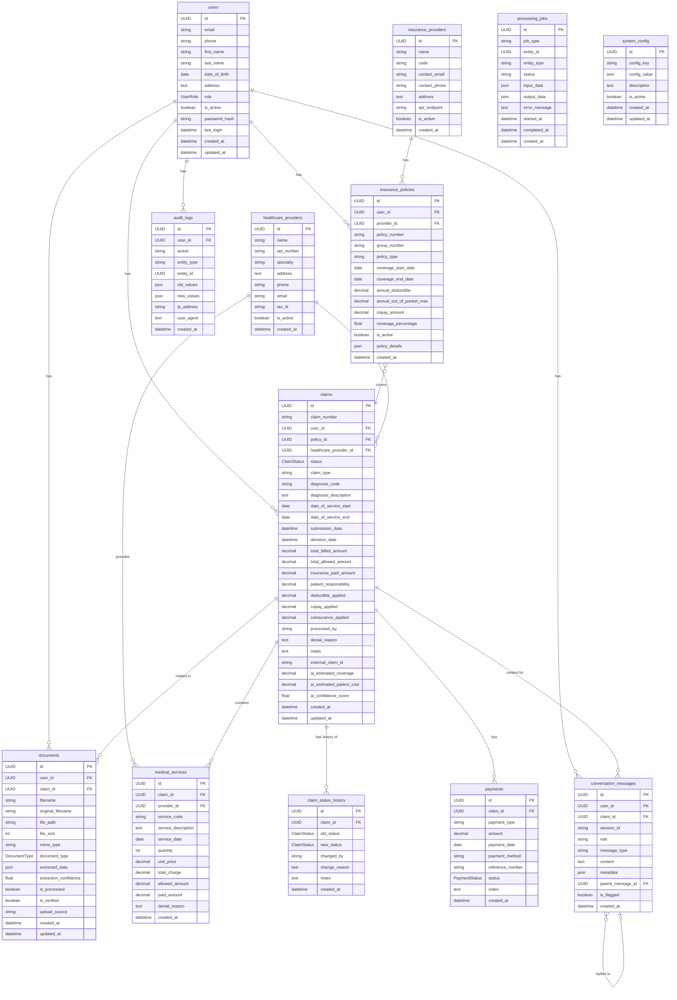

# MedClaim AI - Database Schema Architecture

This document provides a visual representation of the database schema for the MedClaim AI platform. The diagram below illustrates the tables, their fields, and the relationships between them.

## Entity-Relationship Diagram (ERD)

The following ERD is generated using Mermaid syntax and shows the logical structure of the database.

## Table Descriptions and Relationships

### Core Tables

*   **users**: Stores user information, including customers, agents, and administrators. This is the central entity for user management.
*   **claims**: Represents an insurance claim, which is the core business entity. It links together the user, their policy, healthcare services, and associated documents.
*   **documents**: Manages all uploaded files, linking them to users and, optionally, to specific claims.

### Insurance and Healthcare

*   **insurance_providers**: A list of insurance companies.
*   **insurance_policies**: Details of a user's insurance plan with a specific provider.
*   **healthcare_providers**: Information about medical facilities and practitioners (hospitals, clinics, doctors).
*   **medical_services**: Line items on a claim, detailing specific procedures, services, or medications.

### Supporting Tables

*   **claim_status_history**: An audit trail for all status changes a claim goes through.
*   **payments**: Tracks financial transactions related to a claim.
*   **conversation_messages**: Stores chat interactions between users and the AI assistant.

### System and Auditing

*   **processing_jobs**: A queue for managing asynchronous background tasks like AI document analysis.
*   **audit_logs**: Records significant actions performed by users for security and compliance.
*   **system_config**: A key-value store for application-wide settings.

## Foreign Key Relationships

*   `insurance_policies.user_id` -> `users.id`
*   `insurance_policies.provider_id` -> `insurance_providers.id`
*   `claims.user_id` -> `users.id`
*   `claims.policy_id` -> `insurance_policies.id`
*   `claims.healthcare_provider_id` -> `healthcare_providers.id`
*   `documents.user_id` -> `users.id`
*   `documents.claim_id` -> `claims.id`
*   `medical_services.claim_id` -> `claims.id`
*   `medical_services.provider_id` -> `healthcare_providers.id`
*   `claim_status_history.claim_id` -> `claims.id`
*   `payments.claim_id` -> `claims.id`
*   `conversation_messages.user_id` -> `users.id`
*   `conversation_messages.claim_id` -> `claims.id`
*   `conversation_messages.parent_message_id` -> `conversation_messages.id`
*   `audit_logs.user_id` -> `users.id`
# MedClaim AI - Database Schema Architecture

This document provides a visual representation of the database schema for the MedClaim AI platform using Markdown tables.

---

### **`users`**

| Column | Type | Constraints | Description |
|---|---|---|---|
| `id` | UUID | PK | Primary Key |
| `email` | string | | User's email address |
| `phone` | string | | User's phone number |
| `first_name` | string | | User's first name |
| `last_name` | string | | User's last name |
| `date_of_birth` | date | | User's date of birth |
| `address` | text | | User's physical address |
| `role` | UserRole | | User's role (admin, agent, customer) |
| `is_active` | boolean | | Flag for active users |
| `password_hash` | string | | Hashed password |
| `last_login` | datetime | | Timestamp of the last login |
| `created_at` | datetime | | Timestamp of creation |
| `updated_at` | datetime | | Timestamp of last update |

---

### **`insurance_providers`**

| Column | Type | Constraints | Description |
|---|---|---|---|
| `id` | UUID | PK | Primary Key |
| `name` | string | | Name of the insurance company |
| `code` | string | | Unique code for the provider |
| `contact_email` | string | | Contact email |
| `contact_phone` | string | | Contact phone number |
| `address` | text | | Provider's address |
| `api_endpoint` | string | | API endpoint for integration |
| `is_active` | boolean | | Flag for active providers |
| `created_at` | datetime | | Timestamp of creation |

---

### **`insurance_policies`**

| Column | Type | Constraints | Description |
|---|---|---|---|
| `id` | UUID | PK | Primary Key |
| `user_id` | UUID | FK | Foreign Key to `users.id` |
| `provider_id` | UUID | FK | Foreign Key to `insurance_providers.id` |
| `policy_number`| string | | Unique policy number |
| `policy_type` | string | | Type of policy (e.g., PPO, HMO) |
| `coverage_start_date`| date | | Policy start date |
| `coverage_end_date`| date | | Policy end date |
| `is_active` | boolean | | Flag for active policies |

---

### **`claims`**

| Column | Type | Constraints | Description |
|---|---|---|---|
| `id` | UUID | PK | Primary Key |
| `claim_number` | string | | Unique claim identifier |
| `user_id` | UUID | FK | Foreign Key to `users.id` |
| `policy_id` | UUID | FK | Foreign Key to `insurance_policies.id` |
| `status` | ClaimStatus | | Current status of the claim |
| `total_billed_amount` | decimal | | Total amount billed by provider |
| `insurance_paid_amount` | decimal | | Amount paid by insurance |
| `patient_responsibility`| decimal | | Amount owed by the patient |
| `submission_date`| datetime | | Date the claim was submitted |

---

## Relationships

- `users` (1) -- (many) `insurance_policies`
- `users` (1) -- (many) `claims`
- `users` (1) -- (many) `documents`
- `insurance_providers` (1) -- (many) `insurance_policies`
- `insurance_policies` (1) -- (many) `claims`
- `claims` (1) -- (many) `documents`
- `claims` (1) -- (many) `medical_services`
- `claims` (1) -- (many) `payments`
